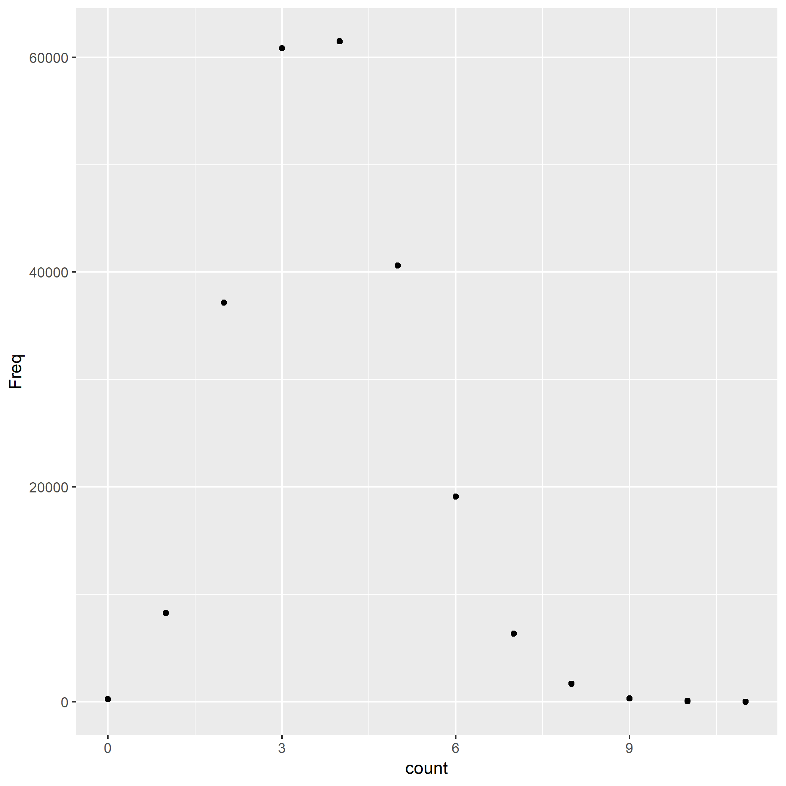

```{r setup, include=FALSE}
vowels <- read.delim("vowels.tsv")
```

On most *nix systems, the file `/usr/share/dict/words` contains a bunch of words. On my machine, it contains `r sum(vowels$Freq)` words.

I counted the times of occurence of vowels in each word, and tabulated the frequency in a table.

The most frequent count is `r with(vowels, count[which.max(Freq)])`. On average, the number of vowels in a word is `r sum(vowels$Freq*vowels$count)/sum(vowels$Freq)`.

Here is a histogram of the occurence of vowels.

